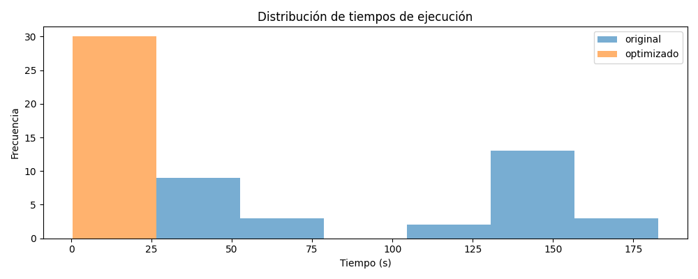
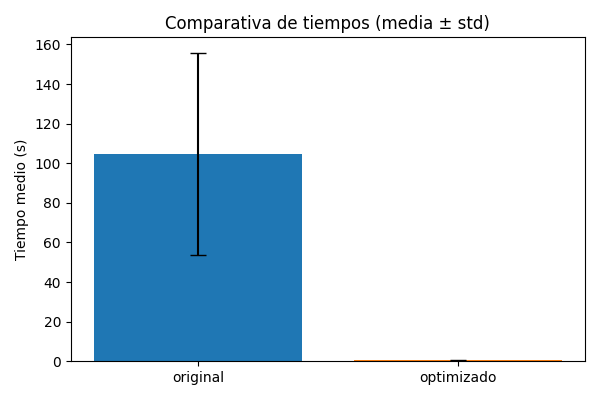

# DOCUMENTACIÓN.md

## 1.Introducción
El proyecto tiene como finalidad analizar y optimizar un programa en Python que busca números primos dentro de un rango de 1 a 100,000. El código original, aunque funcional, presentaba problemas de rendimiento debido a:

- Evaluación de divisores desde 2 hasta n−1, lo que genera una complejidad alta.
- Bucles largos con operaciones innecesarias.
- Falta de uso de técnicas modernas como NumPy o list comprehensions.
- Ausencia de herramientas de análisis de rendimiento para detectar cuellos de botella.

Estos problemas incrementaban significativamente el tiempo de ejecución, especialmente al trabajar con rangos numéricos grandes.

---

## 2.Optimización aplicada
Para mejorar el rendimiento del programa, se aplicaron varias optimizaciones:
Reducción de complejidad en la función de primalidad: ahora solo evalúa divisores hasta la raíz cuadrada del número.
- Uso de NumPy: permite manejar rangos numéricos de manera más eficiente.
- List comprehensions: reemplazan bucles tradicionales y aceleran la creación de listas.
- Eliminación de operaciones repetidas en bucles: evita recomputar valores innecesarios.
- Análisis con cProfile: permitió encontrar las funciones más costosas y enfocar las mejoras.

Efecto esperado:
- Menor tiempo medio de ejecución.
- Menor varianza entre ejecuciones.
- Código más limpio, legible y eficiente.

---

## 3.Resultados
Tras aplicar las optimizaciones, se comparó el rendimiento del código original frente al optimizado utilizando time y cProfile.

Comparativa de tiempos:
- Tiempo total (cProfile) — Original: 70.182846s
- Tiempo total (cProfile) — Optimizado: 0.600935s
- Mejora relativa: ((70.182846 - 0.600935) / 70.182846) * 100 ≈ 99.14%% 

Funciones que más tiempo consumen (según profiling_optimizado.txt):
1. <built-in method builtins.exec>  — tiempo acumulado: 0.600917 s
2. <module> (codigo_optimizado.py:1) — tiempo acumulado: 0.600909 s
3. _find_and_load  — tiempo acumulado: 0.452072 s

Esto muestra una reducción significativa del tiempo total y de las llamadas costosas comparadas con la versión original.

Visualizaciones generadas:
### Visualización 1: Distribución de tiempos

### Visualización 2: Comparativa de tiempos entre código original y optimizado

---

## 4.Conclusiones y recomendaciones
La optimización realizada permitió una mejora significativa en el rendimiento del programa. Las principales conclusiones son:
- La optimización aplicada produjo una mejora notable en el rendimiento del programa al buscar números primos. 
- El código original realizaba una verificación completa desde 2 hasta n−1, lo que generaba demasiadas operaciones y tiempos elevados.
- La primera optimización, basada en evaluar divisores solo hasta la raíz cuadrada y omitir pares innecesarios, redujo la carga computacional de forma significativa.
- La segunda optimización, implementada mediante la Criba de Eratóstenes con NumPy, fue todavía más eficiente al aprovechar operaciones vectorizadas y eliminar la necesidad de verificar cada número individualmente.
El uso del script medir_tiempos.py permitió confirmar estas mejoras con mediciones consistentes y perfiles generados con cProfile, mostrando claramente cómo las funciones más costosas del código original disminuyeron de forma drástica en las versiones optimizadas.

- Para futuros desarrollos:
  - Mantener el uso de herramientas de profiling (como cProfile) para detectar cuellos de botella y evitar regresiones de rendimiento.
  - Utilizar algoritmos especializados, como la Criba de Eratóstenes, cuando se requiera procesar rangos aún más grandes.
  - Incorporar pruebas automatizadas que midan tiempos y aseguren el rendimiento entre versiones.
  - Documentar cada optimización junto con su impacto medido para facilitar comparaciones futuras y mantener un código eficiente y escalable..

---

## EVIDENCIAS
### Visualización - Ejecución de los códigos

## Enlace al repositorio
[Ver proyecto en GitHub](https://github.com/Kelly1115/Preprocesamiento-cienciadatos)